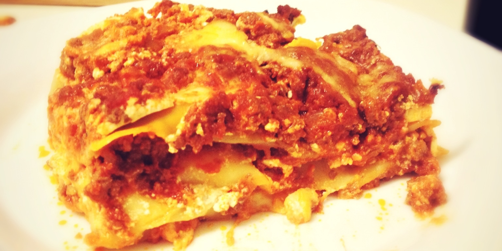

# Піца
---------

###Інгредієнти для тіста:

- мука 3½чш
- сіль 2чл
- цукор 1чл
- оливкова олія 2стл
- тепла вода (40ºС) 1⅓чш
- дріжджі 1шт

###Інгредієнти для червоного соусу:

- томатний соус 1¼чш
- сухий ореґано
- сухий базилік
- часник в гранулах
- цибуля в гранулах
- сіль і перець
- щіпка цукру

###Приготування тіста:

- додати дріжджі до теплої води, відставити на 3хв.
- в мисці змішати муку, сіль, цукор і оливкову олію. Розмішати дріжджі і додати до суміші.
- змішати все разом, поки не вийде однорідне тісто.
- розділити тісто на 2 кульки, поставити їх в дві змазані олією миски і додаткова помазати олією зверху. Накрити миски поліетиленовою плівкою і відставити в тепле місце на 2 години.

###Приготування піци:

- для соусу всі інгредієнти просто змішати разом.
- кульки тіста розтягнути до 25см кругів.
- намазати тісто соусом.
- покласти інші інгредієнти за бажанням.
- зверху притрусити моцарелою.
- пекти 10-15хв в духовці попередньо нагрітій до максимальної температури