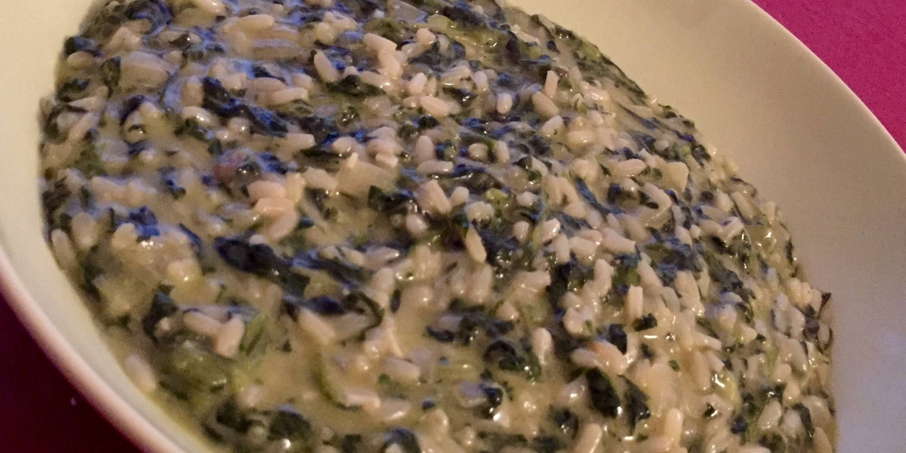

Різотто зі шпинатом
-------------------

###Інгредієнти:

- цибулина
- часник 3 зубчики
- шпинат 500г
- рис 1чш
- росіл 1л
- масло 50г
- сир ½ч (грана падано або пармезан)
- сіль 1чл

Рис і шпинат можна готувати як послідовно (шпинат спочатку) та і одночасно.

###Шпинат

- розігрити глибоку сковорідку до середньої температури, додати оливкову олію
- додати пів цибулини нарізаної кубиками
- згодом додати часник нарізаний пластівцями
- тоді додати помитий і пошатковиний шпинат, накрити пательню кришкою, періодично помішувати
- коли шпинат стане м'яким і більшість рідини випарується, додати сіль і перець

###Рис
- розігрити глибоку сковорідку до середньої температури, додати оливкову олію
- додати пів цибулини нарізаної кубиками
- коли цибуля підсмажиться, додати рис і посмажити 2хв
- додати черпак росолу.
- 20 хвилин поступово додавати росіл і помішувати (**увага:** росіл швидко випаровується і рис може згоріти)
- додати шпинат, масло і сир
- потримити на вогні ще 5хв

