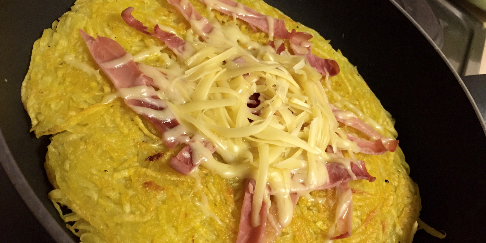

Рошті
-----

###Інгредієнти:

- бульба 1кг (найкраще спеціальна бульба для рошті)
- сіль 1-1½чл
- перець
- оливкова олія
- _шинка_*
- _сир_* _(твердий, жовтий)_

_* за бажанням_

###Приготування:

- потрерти бульбу на грубій терці
- посолити, поперчити, відставити на 5хв
- змастити пательню щедрою кількістю олії, поставити підігріватись на середній вогонь
- видусити рідину з бульби
- як пательня нагріється, рівномірно накласти на неї бульбу
  - _щоб перевітити, чи пательня нагрілась, можна кинути в олію смужку бульби, і послухати, чи шкварчить_
- періодично притискати бульбу лопаткою, щоб рошті краще трималося купи
- ≈ 10хв після смаження, краї рошті висохнуть і порумя'ніє низ, прийшов час перевертати
  - _щоб легше перевернути, можна накрити рошті близькою за діаметром тарілкою, перевернути разом з пательнею, і зсунути рошті другою стороною на пательню_
- (_за бажанням_) якщо є шинка і сир, можна покласти смужки шинки на рошті і притрусити сиром зверху
- ≈ 5хв досмажити другу сторону
