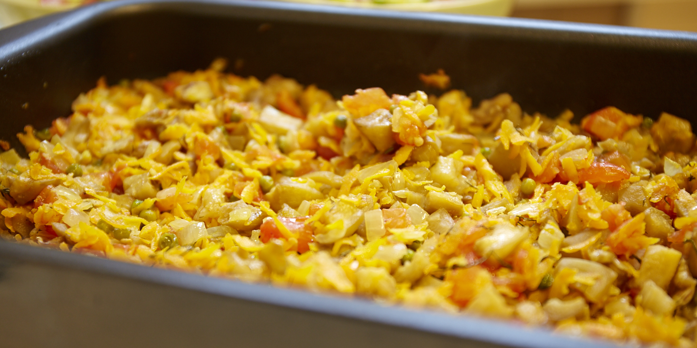

## Запечені овочі _\[в процесі\]_

### Інгредієнти

* морква 6шт
* баклажани 2-3шт
* помідори 5-6шт
* цибуля 1шт

### Приготування:

* почистити і порізати кубиквми баклажани, посолити їх;
* поставити воду для бланширування помідорів;
* почитстити моркву і цибулю, потерти і потушкувати на пательні;
* ввімкнути духовку на 180;
* зняти шкірку з помідорів і порізати кубиками;
* відушити баклажани;
* все змішати. Можна додати ще трошки олії, якщо мало і додати конжут чи інше насіння;
* поставити готуватися в духовку десь на 40 хв.

