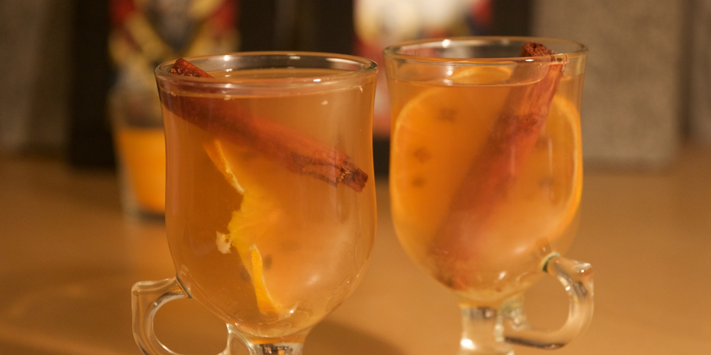

Ґроґ
----

###Інгредієнти:

- сік лайму 1уц
- ром 2уц
- вода 4уц
- цукор 1чл
- кориці паличка
- трохи гвоздики
- _плястерок цитрусу (за бажанням)_

###Приготування:

Закинути все крім води у посудину, в якій буде подаватись Ґроґ. Перемішати, щоб розчинився цукор, скип'ятити воду, додати до всього. Гвоздику можна повстромляти в плястерок цитрусу

Бажано подавати в склянці для ірландської кави. Для цієї склянки пропорції "на око" такі:

- сік ¼ лайму
- рому щоб в сумі трошки менше половини склянки
- води до верху
