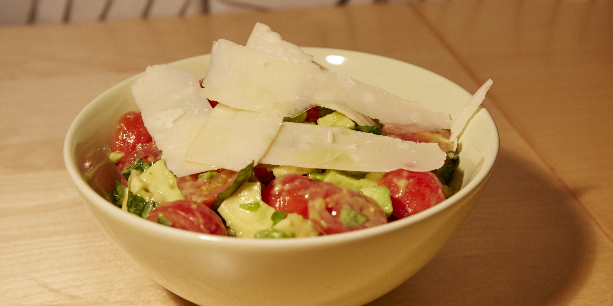

З авокадо та помідорчиками чері
-------------------------------

###Інгредієнти:

- авокадо (не велике) 2шт
- чері помідорчики 250г
- листки базиліку ≈10шт
- оливкова олія 2стл
- цитрина ¼шт
- пармезан _трохи настругати_
- пластівці червоного перцю ¼-½чл
- сіль, перець

###Приготування:

Авокадо порізати на кубики ≈1см. Чері помідорчики розрізати пополам. Базилік дрібно посікти. Все змішати. Додати сік цитрини, олію, перці та сіль. Рекомендується додавати настругані скибки пармезану* зверху, після перемішування салату, так як вони гарно його прикрашають. Замість скибок можна просто дати потертий пармезан.

_***** для "стругання" пармезану потрібно твердий кавалок сиру та інструмент для чищення овочів від шкірки. Ним можна зістругувати із сиру тонкі скибки_