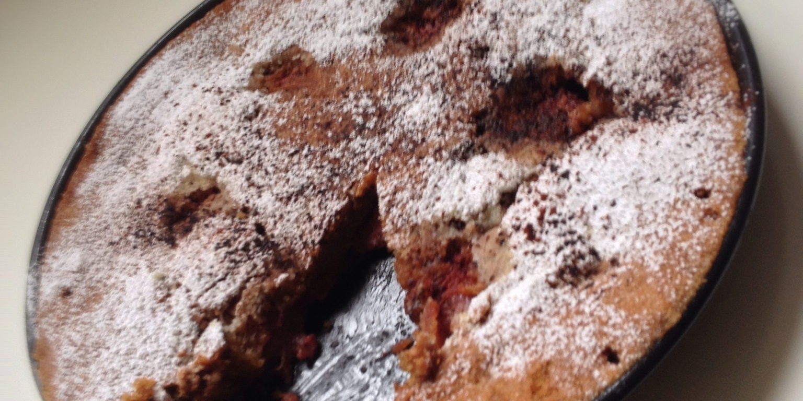

Італійський тарт з полуницями
-----------------------------

###Інгредієнти:

- мука 1½ч
- розпушувач 1½чл
- кориця 1чл
- топлене масло 90г
- яйця 2шт
- цукор ¾чш
- тепле молоко 2стл
- сіль ¼чл
- полуниці

###Приготування:

1. Духовку нагріти до 180 градусів, форму діаметром 22-24см. змастити маслом.
2. Змішати пересіяну муку, корицю, сіль і розпушувач.
3. Окремо збити масло з цукром. Додати до масла яйця і молоко, перемішати. Додати муку і все перемішати.
4. Полуниці розрізати навпіл, викласти на тісто, злегка вдавлюючи.
5. Пекти 30-35 хв.
6. Готовий пляцок вистудити і посипати пудрою.

*Можна разом з полуницями давати і банани.

