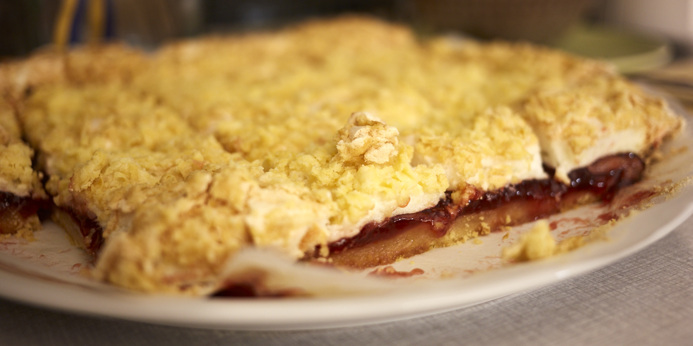

Крухий пляцок від бабусі Олі
---------------

###Інгредієнти:

- мука 300гр
- масло 200гр
- цукор 320гр
- яйця 4шт
- ваніль 20гр
- повидло 400гр
- _цукор пудра*_

_* за бажанням_

###Приготування:

- для тіста змішати муку, масло, 100гр цукру, жовтки і ½ ванілі;
- ¼ тіста поставити в морозилку;
- решту тіста викласти на форму для запікання і посмарувати повидлом;
- з решти інгредієнтів (білки, цукор, ваніль) збити пінку і викласти на пляцок;
- зверху потерти заморожене тісто;
- пекти 45хв на 170º
