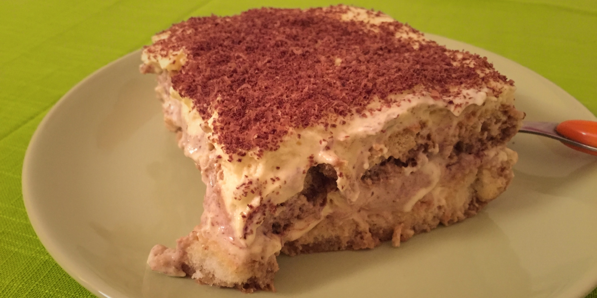

Тірамісу
--------

###Інгредієнти:

- 2 пачки савоярді або жіночих пальчиків (близько 40 штук)
- маскарпоне 500 г
- 6 яєць
- цукор 120 г
- какао порошок
- кава (15 г на пів літри)
- кавовий лікер або ром

###Приготування:
- Зварити каву, додати 2 стл кавового лікеру і дати вистигнути.
- До жовтків додати половину цукру і добре перемішати.
- Додати до жовтків маскарпоне.
- Білки збити з рештою цукру.
- Змішати обидві суміші.
- На дно посудини викласти змочені в каву савоярді.
- Помастити кремом і посипати какао порошком.
- Покласти ще один ряд савоярді і знову помастити.
- Можна посипати знов какао порошком, або якщо хочете солодший десерт, то посипте тертим шоколадом.
